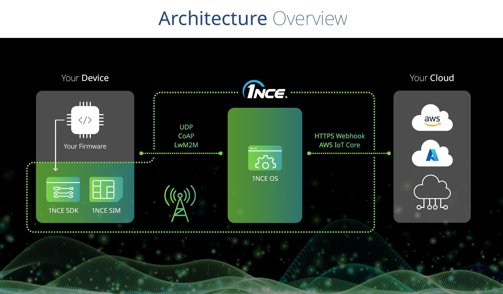
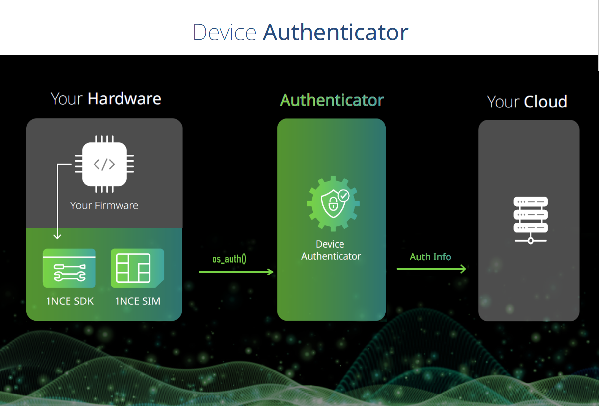
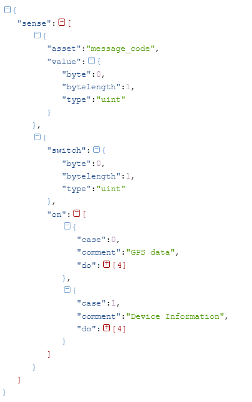
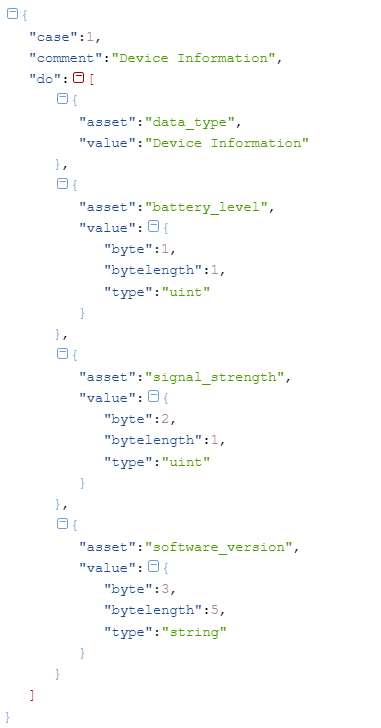

[](https://github.com/1NCE-GmbH/1nce-iot-c-sdk/actions/workflows/ci.yml)
[](./LICENSE)


# 1NCE IoT C SDK

## Overview
**1NCE IoT C SDK** for Embedded C is a collection of C source files under the MIT Open source license that can be used in embedded applications to connect to benefit from different services in 1NCE OS. it contains CoAP Authentication, and energy saver features. This SDK is independent of the platform, can a customer use in any device work with standard C. 

## License
The 1NCE IoT C-SDK is licensed under the [MIT](./LICENSE) open source license.

## Features
1NCE IoT C SDK allows customers a seamless setup and use of all features as part of 1NCE OS. 
1NCE IoT C SDK contains the following services: 

<p align="center"><br>
</p>


### Device Authenticator (CoAP)
The 1NCE IoT c SDK also provides authentication for IoT devices communicating through DTLS. In this case, the device receives a DTLS Identity and a Pre-Shared Key (PSK) that can be used to establish a secure connection to the CoAP endpoint of 1NCE Data Broker.

<p align="center"><br>
</p>

More details about device authentification are available at [1NCE Developer Hub (Device Authenticator)](https://help.1nce.com/dev-hub/docs/1nce-os-device-authenticator). 

### Energy Saver (Binary conversion language)
The Energy Saver aims to minimize the payload size sent from the device to a simple byte array that can be converted to JSON Format. The resulting message is then sent using MQTT via the Data broker. Translating the byte array is done using Binary Conversion language which splits the array into a sequence of values defined in a translation template. 

<p align="center"><br>
</p>

 Check  [1NCE Developer Hub (Energy Saver)](https://help.1nce.com/dev-hub/docs/1nce-os-energy-saver) for further explantion of the translation template creation.

## Versioning
1NCE IoT C SDK releases will follow a [Semantic versioning](https://en.wikipedia.org/wiki/Software_versioning#Semantic_versioning)
Given a version number MAJOR.MINOR.PATCH, increment the:
* MAJOR version when you make incompatible SDK changes,
* MINOR version when you add functionality in a backward-compatible manner,
* PATCH version when you make backward-compatible bug fixes.

## Quick starting with Nordic nRF9160 Development Kit & Zephyr RTOS
1NCE IoT C SDK can be imported as a Zephyr module which is integrated with [nRF Connect SDK](https://www.nordicsemi.com/Products/Development-software/nrf-connect-sdk).

The following commands will import 1NCE IoT C SDK, Nordic nRF Connect SDK and [1NCE Zephyr blueprint](https://github.com/1NCE-GmbH/blueprint-zephyr) which includes CoAP, UDP & LwM2M Demos. 
```
west init -m https://github.com/1NCE-GmbH/1nce-iot-c-sdk
west update
```
Then, using the quickstart command, you can directly build and flash the demos to a connected [nRF9160 Development Kit](https://www.nordicsemi.com/Products/Development-hardware/nrf9160-dk). 

The Default demo establishes a secure connection to 1NCE endpoint via CoAP after receiving DTLS credentials from the Device Authenticator.
```
west quickstart
```
The command can also be used to run udp and lwm2m demos and to enable energy saving.

```
usage: west quickstart [-h] [-p PROTOCOL] [-e ENERGYSAVING]

Build and flash CoAP (With DTLS), LwM2M or UDP Demos, the payload reduction (using 1NCE Energy saver) can also be enabled.

options:
  -h, --help            show this help message and exit
  -p PROTOCOL, --protocol PROTOCOL
                        Select the protocol: coap (Default), lwm2m or udp
  -e ENERGYSAVING, --energysaving ENERGYSAVING
                        Set to "y" to enable energy saver
```

## Generic Getting started guide

**This section shows you:**

* How to get the identity and pre-shared key using 1nce Device Authenticator. (for CoAP application).
* How to use 1NCE Energy Saver to reduce the data (and/ or Energy) consumption. 

### The Scenario

The Example shows how to set up and integrate 1nce SDK in Embedded Application written in C.


### Prerequisite Tasks

The SDK requires using a 1NCE SIM card with a connected AWS account configured through [1NCE Portal](https://portal.1nce.com/). GCC must also be installed to compile the project. For more information, see the https://gcc.gnu.org/install/index.html. you can find the downloads of the compiler.

#### Contents
 * [Step 1: Clone Repository](#Step1_Clone_Repository)
 * [Step 2: Implement abstract functions](#Step2_Implement_abstract_functions)
 * [Step 3: Integrate SDK in your Application](#Step3_Integrate_SDK_in_your_Application)
 * [Step 4: Run your Application](#Step4_Run_your_Application)
### Step 1: Clone Repository 
you clone the SDK for Embedded C in your project using git clone
To clone using HTTPS
```
git clone https://github.com/1NCE-GmbH/1nce-iot-c-sdk.git
```
Using SSH
```
git clone git@github.com:1NCE-GmbH/1nce-iot-c-sdk.git 
```

### Step 2: Implement abstract functions
You need to implement your four transport functions how you want to access our endpoint. 

* nce_os_udp_connect
* nce_os_udp_send
* nce_os_udp_recv
* nce_os_udp_disconnect

To implement your functions, we recommend to see our Blueprints 


[FreeRTOS BluePrint](https://github.com/1NCE-GmbH/blueprint-freertos)

[Zephyr BluePrint](https://github.com/1NCE-GmbH/blueprint-zephyr)


### Step 3: Integrate SDK in your Application

1NCE SDK is simple to integrate in every Embedded App written with C, To begin, you need to define an object type OSNetwork_t and affect to their variable the network socket and implemented functions as shown in the example below.

```
OSNetwork_t xOSNetwork= { 0 };
os_network_ops_t osNetwork={
		.os_socket=&xOSNetwork,
		.nce_os_udp_connect = nce_os_udp_connect_impl,
		.nce_os_udp_send = nce_os_udp_send_impl,
		.nce_os_udp_recv = nce_os_udp_recv_impl,
		.nce_os_udp_disconnect = nce_os_udp_disconnect_impl };
```

#### 1. CoAP
With CoAP protocol  (using DTLS) you can call ```os_auth```
```
    DtlsKey_t nceKey={0};
    int result =	os_auth(&osNetwork,&nceKey);
```
then we can have ```psk``` and ```pskIdentity``` stored in ```DtlsKey_t``` struct.

#### 2. Energy Saver

```os_energy_save``` function can be used to convert payloads to binary format. The following figure shows a sample translation template that can be used to share GPS data and device information: 

<p align="center"><br>
</p>

Considering case 1:

<p align="center"><br>
</p>

The binary payload for this case can be generated as follows

```
    /* values to be sent conform to the template information*/
	Element2byte_gen_t battery_level = {.type= E_INTEGER,.value.i=99,.template_length=1};
    Element2byte_gen_t signal_strength = {.type= E_INTEGER,.value.i=84,.template_length=1};
    Element2byte_gen_t software_version = {.type= E_STRING,.value.s="2.2.1",.template_length=5};
   
    uint8_t selector = 1;  /* select case 1 */
	char pcTransmittedString[500];
	int status=1;
	/* if status=1 then the energy save failed */
	status=os_energy_save(pcTransmittedString,selector, 3,battery_level,signal_strength,software_version);
	
```
The resulting packet can then be sent to the energy saver for further processing

#### 3. LOG Interface 

Complete the following  macros  in ```log_interface.h``` 
```
#define NceOSLogInfo( format, ... ) 
#define NceOSLogDebug( format, ... ) 
#define NceOSLogError( format, ... ) 
#define NceOSLogWarn( format, ... )
```
If you are using FreeRTOS you can just use the macro  ```#define FREERTOS```

### Step 4: Run your Application
Run your code in ISO C90

## Generating documentation
The Doxygen references were created using Doxygen version 1.9.2. To generate the Doxygen pages, please run the following command from the root of this repository:
```
doxygen docs/doxygen/Doxyfile
```
## Asking for Help

The most effective communication with our team is through GitHub. Simply create a [new issue](https://github.com/1NCE-GmbH/1nce-iot-c-sdk/issues/new/choose) and select from a range of templates covering bug reports, feature requests, documentation issue, or Gerneral Question.

## Contributing
See [CONTRIBUTING.md](./CONTRIBUTING.md) for information on contributing
